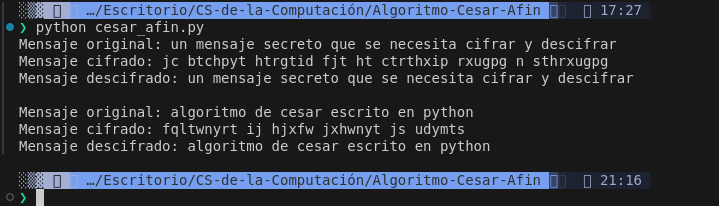
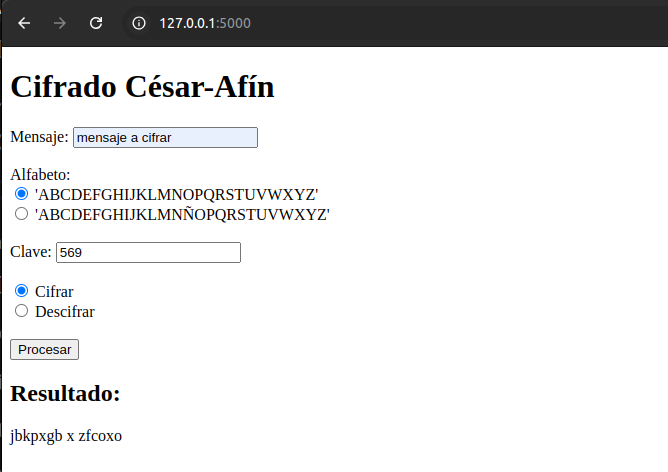
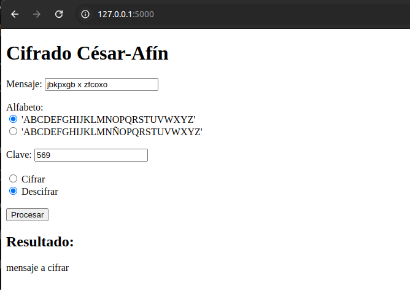

# Cifrado César afín

## Descripción General

Este proyecto, con base en ciencias de la computación, implementa un cifrado César afín utilizando Python y Flask. El cifrado César es una técnica de encriptación simple en la se hace uso de la aritmética modular para que cada letra del texto se desplace un número fijo de posiciones en el alfabeto.

Se puede cifrar o descifrar un mensaje utilizando una clave que indica cuántas posiciones se desplazarán las letras.

El objetivo principal de este proyecto es proporcionar una interfaz web para cifrar y descifrar mensajes utilizando este método.

## Instalación y ejecución

Para instalar este proyecto, sigue estos pasos:

1. Clona el repositorio: `git clone https://github.com/tu-repo/nombre-del-proyecto.git`
2. Navega al directorio del proyecto: `cd nombre-del-proyecto`
3. Instala las dependencias: `pip install flask`

## Uso

1. Ejecuta la aplicación Flask:

    ```sh
    python app.py
    ```

   -O bien ejecuta `python cesar_afin.py` sin necesidad de tener instalado flask, para correr unas pruebas predefinidas.

2. Abre tu navegador web y navega a `http://127.0.0.1:5000/`.
3. Ingresa el mensaje, selecciona el alfabeto, ingresa la clave y selecciona la acción (cifrar o descifrar).
4. Haz clic en "Procesar" para ver el resultado.

## Capturas de pantalla




### Resultado del cifrado



### Resultado del descifrado


